# Wyspa

Natywna aplikacja macOS, która zamienia notch MacBooka w interaktywną wyspę w stylu Dynamic Island.
Projekt open source (licencja MIT), dystrybucja poza App Store — budujesz i instalujesz sam.

Jeśli Wyspa Ci się przydaje: [wesprzyj autora na Suppi](https://suppi.pl/itomori94) ☕

## Zrzuty ekranu

### Zwinięta wyspa

| | |
|---|---|
|  Teraz odtwarzane |  Głośność |
| 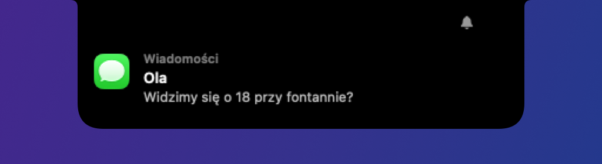 Powiadomienie | 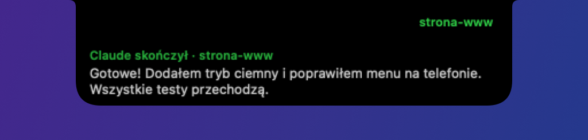 Claude skończył |
|  Spotkanie za chwilę |  Karta ze skryptu (`wyspa notify`) |
|  Postęp ze skryptu (`wyspa progress`) |  Pobieranie |
|  Pomodoro |  Wyciszony mikrofon |
|  Ładowarka |  AirPods |

### Rozwinięta wyspa

| | |
|---|---|
| 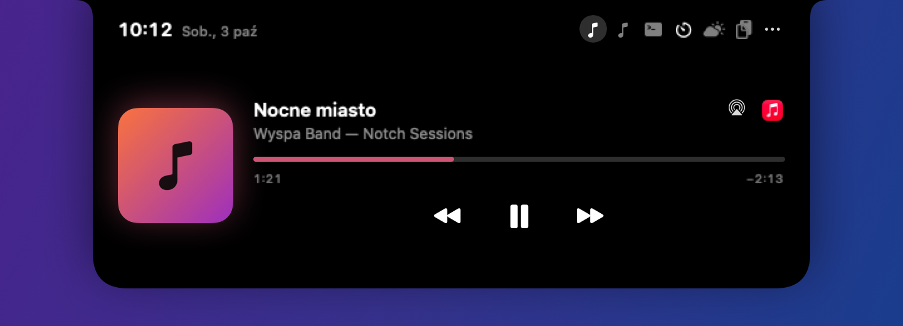 Odtwarzacz z AirPlay | 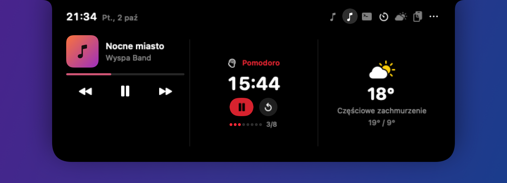 Kilka widżetów na stronie |
| 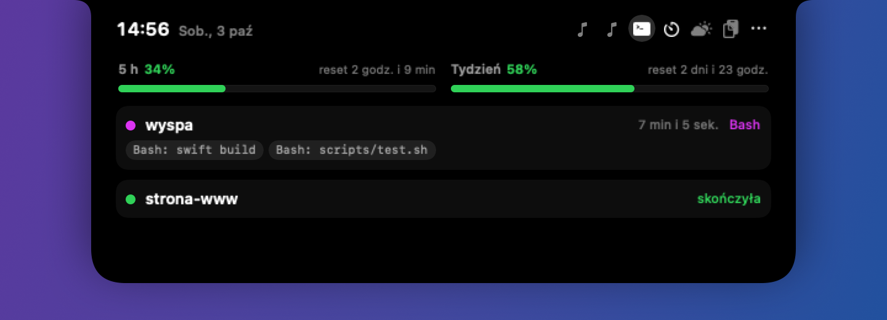 Claude Code z limitami planu | 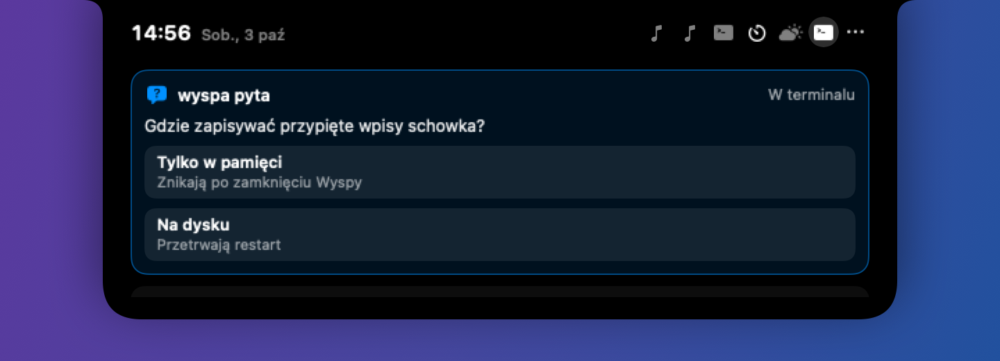 Pytanie Claude z opcjami |
| 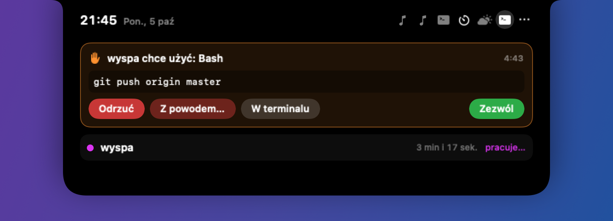 Prośba o zgodę (z powodem odmowy) | 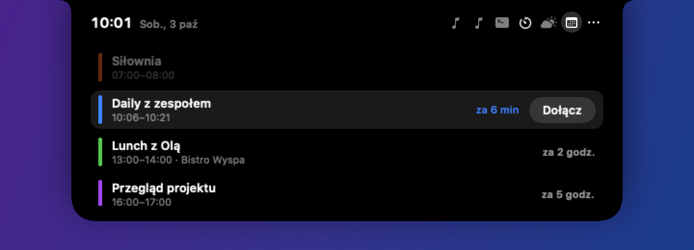 Kalendarz z „Dołącz” |
| 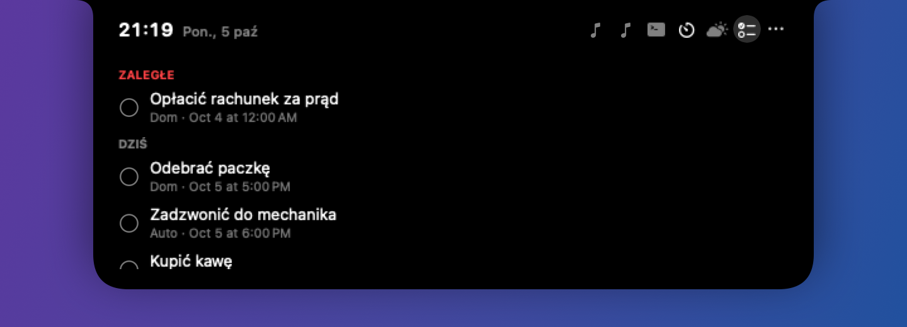 Przypomnienia | 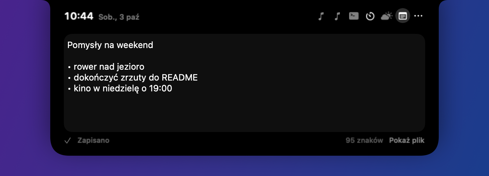 Notatka |
| 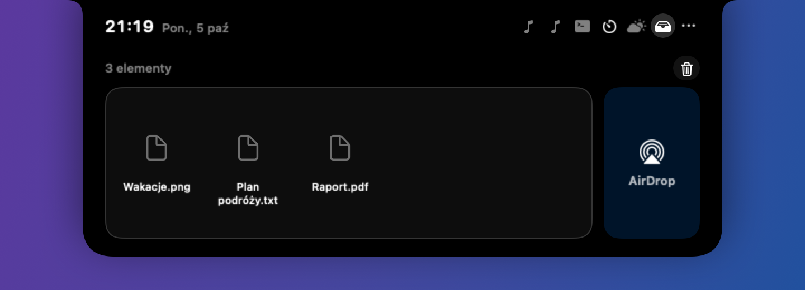 Półka z AirDrop | 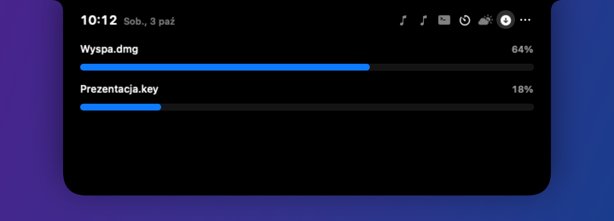 Pobierania |
| 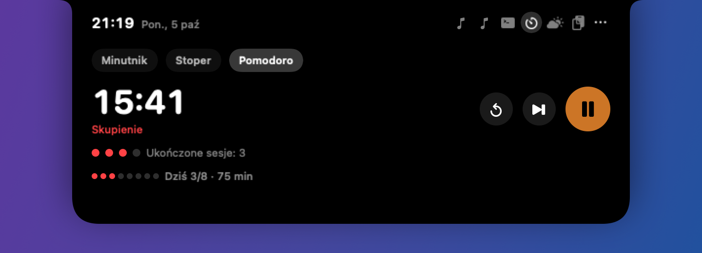 Pomodoro i cel dnia | 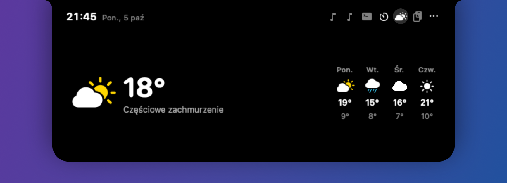 Pogoda |
| 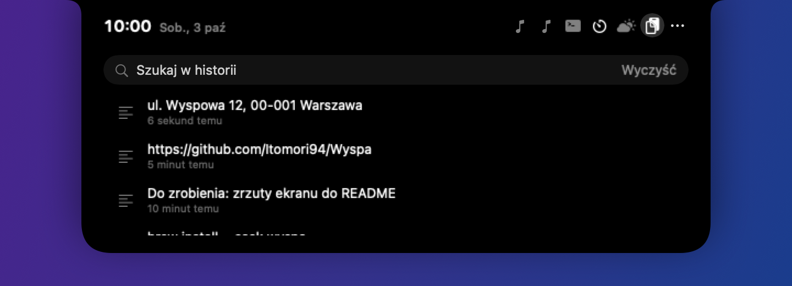 Historia schowka | 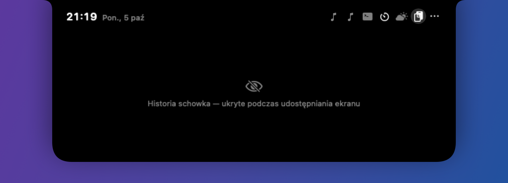 Tryb prywatny (udostępnianie ekranu) |
| 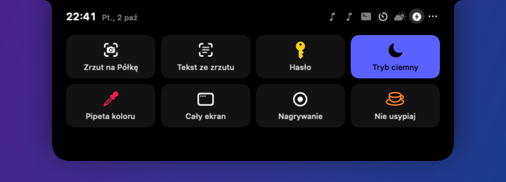 Szybkie akcje | 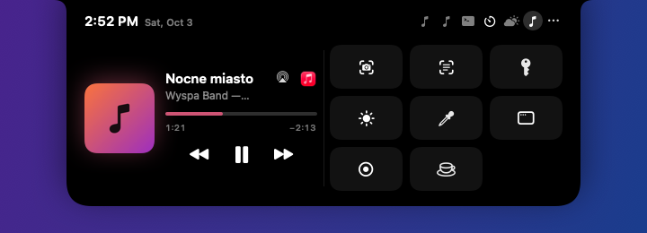 Szybkie akcje jako widżet |
| 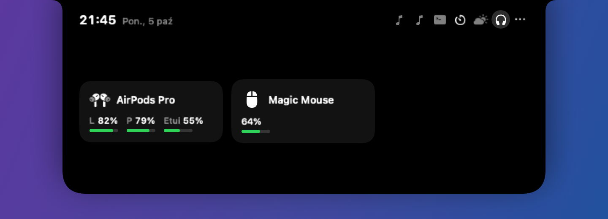 Bluetooth | 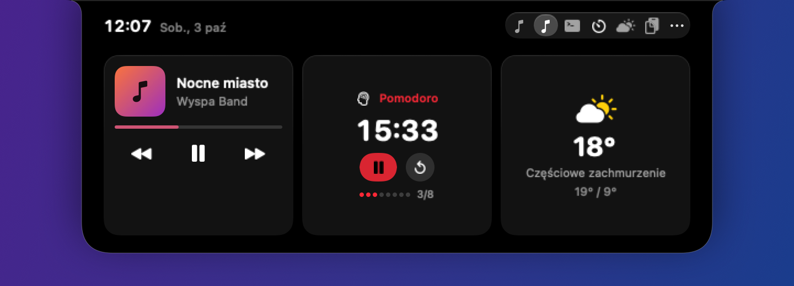 Motyw Czarna tafla |

Zrzuty powstają z danych demonstracyjnych (`scripts/screenshots.sh`), więc nie zawierają prywatnych treści.

## Wymagania

- macOS 14 Sonoma lub nowszy, Apple Silicon albo Intel.
- Xcode (do budowania; wystarczy zainstalowany, budujemy z terminala).

## Instalacja

```bash
git clone https://github.com/Itomori94/Wyspa.git && cd Wyspa
scripts/dev-cert.sh        # jednorazowo, lokalny certyfikat do podpisu
scripts/install.sh         # buduje i instaluje /Applications/Wyspa.app, uruchamia ją
```

`dev-cert.sh` tworzy samopodpisany certyfikat „Wyspa Development” w pęku kluczy logowania.
Dzięki niemu macOS pamięta przyznane zgody po każdym ponownym zbudowaniu aplikacji.
Bez certyfikatu `build-app.sh` podpisze aplikację ad-hoc, a zgody trzeba będzie nadawać od nowa.

Przy pierwszym podpisie macOS może zapytać, czy `codesign` może użyć klucza — wybierz „Zawsze pozwalaj”.

## Obsługa

- **Najechanie** na notch: wyspa lekko się powiększa, po chwili rozwija (opóźnienie w ustawieniach).
- **Najechanie na skrzydło** (obok notcha, np. okładkę albo przekreślony mikrofon): skrzydła chowają się do notcha
  i odsłaniają ikony paska menu pod spodem; wracają, gdy kursor zjedzie z paska (do wyłączenia w ustawieniach).
- **Kliknięcie** albo **przesunięcie dwoma palcami w dół**: rozwija od razu. Kliknięcie aktywności (okładki, timera,
  Claude) otwiera stronę jej modułu — także w nagłówku rozwiniętej wyspy. Gdy moduł nie ma strony w układzie,
  jego widok pokazuje się doraźnie (np. prośba Claude o zgodę zawsze ma gdzie się wyświetlić). Gdy pod notchem wisi karta (powiadomienie, odpowiedź Claude), kliknięcie trafia do karty.
- **Przesunięcie w górę** albo zjechanie kursorem: zwija.
- **Przesunięcie w poziomie** w rozwiniętej wyspie: zmienia zakładkę modułu.
- **⌃⌥W** (domyślnie, do zmiany w ustawieniach): rozwija lub zwija wyspę na ekranie z kursorem.
- Ikona w pasku menu: ustawienia, **Sprawdź aktualizacje…** (działa także przy wyłączonym module Aktualizacje),
  numer zainstalowanej wersji i zamknięcie aplikacji.

### Motywy

Ustawienia → Wyspa → **Motyw**:
- **Klasyczny**: czarna wyspa, widżety rozdzielone kreskami.
- **Czarna tafla**: czarna wyspa z cienką jasną krawędzią, zakładki w kapsule, każdy widżet na osobnej karcie.
- **Szkło**: rozwinięta wyspa i karty z rozmytego szkła (suwak *Przyciemnienie szkła*); przy samym notchu wyspa
  zostaje czarna, żeby zlewała się z wycięciem ekranu.

Motyw nie zmienia ikon: okładki, ikony aplikacji (np. Apple Music) i symbole modułów wyglądają tak samo w każdym.

### Klawiatura po skrócie

Skrót wyspy (domyślnie ⌃⌥W) rozwija ją od razu z klawiaturą, bez zabierania fokusu aplikacji, w której pracujesz:
**← →** zmieniają strony, **pisanie** przechodzi do Historii schowka i szuka, **↑ ↓** wybierają wpis, **Enter** go wkleja
(wyspa się zwija, a tekst trafia tam, gdzie był kursor), **Esc** zwija wyspę. W polu tekstowym (np. Notatka) klawisze
należą do pola.

## Uprawnienia

Każdy moduł wymagający uprawnienia jest domyślnie wyłączony i prosi o nie dopiero przy pierwszym włączeniu.
Wyłączony moduł nie działa w tle.

| Uprawnienie | Kto go używa |
|---|---|
| — | Fundament wyspy nie wymaga żadnych uprawnień |
| — | **Teraz odtwarzane** przez mediaremote-adapter nie wymaga uprawnień |
| — | **Półka** nie wymaga uprawnień |
| Lokalizacja | **Pogoda** (okolica do ok. 1 km). Pytanie pojawia się przy włączeniu modułu |
| Dostępność | **HUD głośności i jasności** (przechwytywanie klawiszy) oraz **Powiadomienia** (odczyt banerów). Po nadaniu w Ustawieniach systemowych moduł startuje sam |
| — | **Zasilanie** nie wymaga uprawnień |
| Bluetooth | **Bluetooth** (podłączenie urządzeń i poziom baterii słuchawek) |
| Kalendarze | **Kalendarz** |
| Przypomnienia | **Przypomnienia** |
| Kamera | **Lusterko** (tylko gdy zakładka jest otwarta) |
| — | **Timer**, **Notatka**, **Historia schowka**, **Skróty** nie wymagają uprawnień |
| — | **Claude Code** nie wymaga uprawnień systemowych; instalacja hooków zmienia `~/.claude/settings.json` (z kopią zapasową) |
| Automatyzacja: Terminal, iTerm2 | **Claude Code**: przejście do właściwej karty terminala (system pyta przy pierwszym użyciu) |
| Automatyzacja: Muzyka, Spotify | **Teraz odtwarzane** w trybie awaryjnym AppleScript (system pyta przy pierwszym użyciu) |

Tabela rośnie wraz z kolejnymi modułami.

## Moduły

### Teraz odtwarzane

Okładka, tytuł, wykonawca, pasek przewijania i sterowanie dla dowolnej aplikacji odtwarzającej dźwięk
(Muzyka, Spotify, przeglądarki, podcasty). W zwiniętej wyspie: miniatura okładki i wizualizer w kolorze okładki.
Gdy Muzyka nie oddaje okładki (np. utwór z subskrypcji grany przez AirPlay), Wyspa szuka jej w katalogu iTunes:
do Apple trafiają wtedy tytuł i wykonawca utworu (bez konta, raz na utwór).

W Ustawieniach → Moduły → Teraz odtwarzane wybierasz:

- **Pokazuj dźwięk z**: *Cały system* (każda aplikacja, w tym przeglądarki) albo *Tylko Apple Music*.
  W trybie *Tylko Apple Music* wyspa pokazuje Muzykę wtedy, gdy to ona jest bieżącym odtwarzaczem w systemie;
  gdy gra inna aplikacja, wyspa zachowuje się, jakby nic nie grało.
- Źródło danych wybiera się samo: adapter MediaRemote, a gdy nie działa — AppleScript (Muzyka i Spotify).

Przy utworze z Apple Music w odtwarzaczu jest przycisk **AirPlay**: wybór głośników (MacBook, Apple TV, HomePod),
dźwięk przechodzi wyłącznie na wybrany głośnik.

Muzyka grająca przez AirPlay (np. na Apple TV) nie jest widoczna dla MediaRemote — wtedy wyspa bierze dane wprost
z aplikacji Muzyka (AppleScript, bez odpytywania). Przy pierwszym razie macOS zapyta o zgodę na sterowanie Muzyką.
Utwory z subskrypcji Apple Music nie mają wtedy okładki na dysku — Wyspa szuka jej w katalogu iTunes
(itunes.apple.com, wysyłane są tylko wykonawca i tytuł; najwyżej jedno zapytanie na utwór).

### Półka

Przeciągnij plik, obraz, link albo tekst nad notch: wyspa się rozwinie i pokaże półkę. Upuść na półkę, żeby odłożyć,
albo na pole AirDrop, żeby od razu wysłać.

- Klik zaznacza, ⌘-klik dodaje do zaznaczenia, ⇧-klik zaznacza zakres, dwuklik otwiera.
- Przeciągnij kafelek poza wyspę, żeby wyciągnąć plik (całe zaznaczenie naraz).
- Ikona oka: podgląd Quick Look zaznaczonych elementów. Prawy przycisk: Otwórz, Podgląd, Pokaż w Finderze, Usuń.
- Pliki z dysku zostają na swoim miejscu (półka trzyma tylko odnośnik i nadąża za przeniesieniem pliku).
  Obrazy i linki przeciągnięte z przeglądarki są kopiowane do `~/Library/Application Support/Wyspa/Shelf`.
- Półka przetrwa restart aplikacji i komputera. Usunięcie z półki nigdy nie kasuje Twoich oryginałów.

### HUD głośności i jasności

Klawisze głośności, wyciszenia, jasności ekranu i podświetlenia klawiatury pokazują poziom w wyspie zamiast
systemowego okienka: ikona po lewej stronie notcha, procent po prawej, a jeden pasek poziomu wysuwa się
wyśrodkowany tuż pod notchem. ⇧⌥ z klawiszem zmienia poziom drobniejszymi krokami, sam ⌥ otwiera ustawienia systemowe jak zwykle.
Każdy rodzaj można wyłączyć osobno w ustawieniach modułu. Urządzenia audio bez regulacji głośności (np. część
wyjść HDMI) zostają obsługiwane przez system.

### Zasilanie

Krótka aktywność w wyspie po podłączeniu i odłączeniu ładowarki, po pełnym naładowaniu i przy 20% oraz 10% baterii.
Zakładka z poziomem baterii i szacowanym czasem ładowania albo pracy.

### Bluetooth

Krótka aktywność po podłączeniu i odłączeniu urządzenia: ikona (AirPods, słuchawki, klawiatura, mysz…) i poziom baterii.
Zakładka z listą połączonych urządzeń i baterią lewej i prawej słuchawki oraz etui.
Gdy bateria urządzenia spadnie do 20%, wyspa pokazuje czerwone ostrzeżenie — raz na rozładowanie (ponownie po
naładowaniu powyżej 30%). Poziom jest odczytywany co 5 minut, tylko gdy podłączone jest urządzenie podające baterię.
Baterii iPhone'a macOS nie udostępnia publicznie, więc Wyspa jej nie pokazuje.

### Układ wyspy

Ustawienia → Układ to graficzny edytor rozwiniętej wyspy, podobny do NotchNook:

- **Strony**: wyspa ma jedną albo kilka stron. Strona z widżetami pokazuje kilka modułów obok siebie
  (np. odtwarzacz, kalendarz i timer), a strona z pełnym widokiem — jeden moduł na całą szerokość (np. półka).
  Między stronami przełączasz się przesunięciem w poziomie albo ikonami w nagłówku wyspy.
- **Podgląd w skali**: edytor rysuje wyspę w Twoim rozmiarze, z zaznaczonym notchem i prawdziwymi widżetami.
- **Przeciąganie**: moduł z listy poniżej przeciągnij na stronę; widżety przeciągaj, żeby zmienić kolejność albo
  przenieść na inną stronę (upuść na nazwie strony u góry); przeciągnij widżet z powrotem na listę, żeby go usunąć.
- **Szerokość**: przeciągnij uchwyt między widżetami — szerokość zmienia się płynnie, a w trakcie widać procent.
  Każdy widżet ma minimalną szerokość; edytor nie pozwoli zwęzić go bardziej.
- Odtwarzacz na dużej szerokości (np. sam na stronie) wygląda jak pełny odtwarzacz z paskiem przewijania.
- Nowo włączony moduł dołącza do ostatniej strony z widżetami (najwyżej trzy na stronę), a odtwarzacz, półka
  i schowek dostają własne strony. **Uporządkuj automatycznie** układa wszystko od nowa według tych reguł.

### Kalendarz i Przypomnienia

Plan dnia z przyciskiem „Dołącz” dla Meet, Zoom, Teams, Webex, Whereby, Jitsi i FaceTime. Na 10 minut przed spotkaniem
zwinięta wyspa pokazuje odliczanie. Przypomnienia: zaległe i na dziś, odhaczane jednym kliknięciem.

### Timer

Minutnik (gotowe 1–60 min albo dowolny czas), stoper i Pomodoro (25 min skupienia, 5 min przerwy, 15 min co 4 sesje).
Odliczanie widać w zwiniętej wyspie; koniec sygnalizuje dźwięk i rozwinięcie wyspy. Timer przetrwa restart aplikacji.
W trybie Pomodoro widać dzisiejszy wynik: kropki ukończonych sesji skupienia i minuty (liczą się tylko fazy
dobiegnięte do końca); dzienny cel ustawiasz w ustawieniach modułu. Podczas fazy skupienia karty powiadomień
(moduł Powiadomienia) czekają, a po jej końcu przychodzi podsumowanie („Po skupieniu: 7 powiadomień”, z listą aplikacji)
i najnowsze karty po kolei; pauza i przerwa kończą wstrzymanie. Do wyłączenia w ustawieniach Timera.

### Notatka

Kliknij w tekst, żeby pisać — dopiero wtedy wyspa przejmuje klawiaturę. Zapis automatyczny. Esc zwija wyspę i oddaje
klawiaturę poprzedniej aplikacji.

### Historia schowka

Ostatnie teksty, pliki i obrazy z wyszukiwaniem (bez rozróżniania polskich znaków). Kliknięcie wkleja wpis prosto do
aplikacji, w której piszesz (wyspa się zwija, Wyspa wysyła ⌘V — wymaga uprawnienia Dostępność; bez niego albo po
wyłączeniu tej opcji kliknięcie tylko kopiuje). Pinezka przy wpisie go przypina: przypięte są na górze, nie wypadają
z historii przez limit i zostają po „Wyczyść”. Wpis z plikiem, którego już nie ma (np. usuniętym z Półki), jest przekreślony; kliknięcie usuwa go z historii zamiast wklejać martwy odnośnik. Hasła z menedżerów haseł (oznaczone jako poufne) i treści tymczasowe
nie są zapisywane. Historia, także przypięta, jest tylko w pamięci — znika po wyłączeniu modułu albo aplikacji.

### Skróty i Lusterko

Skróty: ulubione Skróty macOS jako przyciski (wybór w ustawieniach modułu). Lusterko: podgląd z kamery;
kamera działa tylko, gdy zakładka Lusterka jest widoczna.

### Powiadomienia

Wyłączony domyślnie, wymaga Dostępności. Powiadomienia macOS pojawiają się jako karta pod notchem: ikona i nazwa
aplikacji, tytuł, treść. Karta znika po kilku sekundach (czas w ustawieniach), najechanie ją zatrzymuje, kliknięcie
otwiera aplikację, kolejne powiadomienia czekają w kolejce („+2”). Systemowy baner jest domyślnie chowany
(do wyłączenia w ustawieniach) — powiadomienie i tak zostaje w Centrum powiadomień. Podczas skupienia Pomodoro karty
czekają do końca sesji (patrz Timer); bez chowania banera wyspa w tym czasie nie pokazuje kart, żeby nie dublować
banera systemowego.

### Claude Code

Podgląd sesji Claude Code w wyspie: projekt, stan (pracuje, używa narzędzia, prosi o zgodę, czeka na Ciebie, skończyła)
i ostatnie narzędzia. Kilka sesji naraz.

- **Instalacja**: Ustawienia → Moduły → Claude Code → *Zainstaluj hooki*. Wyspa dopisuje swoje wpisy do
  `~/.claude/settings.json`, robiąc obok kopię zapasową; Twoje inne hooki zostają. *Odinstaluj* usuwa tylko wpisy Wyspy.
  Hooki wskazują stałego pośrednika poza aplikacją, więc przeniesienie Wyspy ich nie psuje (starsze instalacje:
  *Zaktualizuj ścieżkę*).
- **Zgody z wyspy**: prośba o uprawnienie rozwija wyspę i pokazuje narzędzie z podglądem (polecenie, diff edycji,
  początek nowego pliku). *Zezwól*, *Odrzuć* albo *W terminalu*. Brak decyzji w ustalonym czasie (domyślnie 5 min)
  albo wyłączona Wyspa = zwykły prompt w terminalu, jak bez Wyspy.
- **Pytania z opcjami**: gdy Claude zadaje pytanie z wyborem, wyspa pokazuje je z przyciskami — klik odpowiada
  bez wracania do terminala (*W terminalu* zostawia pytanie w Claude Code). Przy prośbie o zgodę *Z powodem…* odrzuca
  ją z wpisanym wyjaśnieniem dla Claude.
- **Dźwięk i pulsowanie**, gdy sesja czeka albo kończy; cisza, gdy terminal tej sesji jest na wierzchu.
- **Limity planu** (Pro/Max): *Pokazuj limity* w ustawieniach modułu ustawia linię statusu Claude Code na
  `wyspa-hook --statusline`. Wyspa pokazuje zużycie okna 5-godzinnego i tygodniowego z odliczaniem do resetu,
  a w terminalu pojawia się pasek „5h 23% · tydz. 41%” (bez podpowiedzi klawiszy Claude Code). Twojej własnej linii
  statusu Wyspa nie nadpisuje.
- **Podgląd odpowiedzi**: po zakończeniu pracy pod notchem pojawia się karta z początkiem odpowiedzi Claude;
  kliknięcie przenosi do terminala, najechanie zatrzymuje kartę. Na liście sesji widać, od kiedy sesja pracuje.
- **Kliknięcie sesji** przenosi do jej terminala: właściwa karta w Terminalu i iTerm2, właściwe okno w VS Code i Cursor;
  w innych terminalach aplikacja przechodzi na wierzch.

### Pobierania

Pobierany plik (Safari, Chrome i inne przeglądarki pokazujące postęp na ikonie w Finderze) widać w zwiniętej wyspie
jako pierścień postępu z procentem; kilka pobierań naraz — łączny postęp. Po zakończeniu plik trafia na Półkę
(do wyłączenia). Bez odpytywania: wyspa odbiera postęp publikowany przez przeglądarkę, odświeża się co pełny procent.

### Mikrofon

Globalny skrót (domyślnie ⌃⌥M, do zmiany w ustawieniach modułu) wycisza i włącza **wszystkie** mikrofony naraz (także ten, który Jabber, Zoom, Teams czy Discord wybrały inaczej niż system,
i podłączony w trakcie wyciszenia); kliknięcie
widżetu robi to samo. Wyciszony mikrofon to czerwona ikona w zwiniętej wyspie (ważniejsza niż odtwarzanie i spotkanie,
mniej ważna niż timer i prośby Claude). Każdy mikrofon dostaje wyciszenie i głośność wejścia ustawioną na zero
(programy do rozmów potrafią pominąć samo wyciszenie) — po włączeniu wraca poprzednia głośność. Mikrofon iPhone'a
przez Continuity nie daje się wyciszyć; ustawienia modułu pokazują stan każdego mikrofonu. Bez zgody na mikrofon: Wyspa nie słucha dźwięku, zmienia tylko
ustawienie urządzenia (publiczne CoreAudio, zmiany z Ustawień systemowych widać od razu, bez odpytywania). Przełączeniu towarzyszy krótki dźwięk (niższy przy wyciszeniu, wyższy przy włączeniu) — do wyłączenia w ustawieniach modułu.

### Aktualizacje

Wyspa porównuje wersję, z której została zbudowana, z najnowszą na GitHubie — przy włączeniu modułu i potem co
6 godzin. Gdy jest coś nowego, w wyspie na chwilę pojawia się karta z liczbą zmian, a w ustawieniach modułu lista
zmian i przycisk **Zaktualizuj teraz**: pobiera zmiany do katalogu projektu (`git pull --ff-only`), buduje
i instaluje nową wersję — okienko pokazuje postęp (budowanie trwa kilka minut), potem Wyspa zamknie się i uruchomi
ponownie sama. Gdy coś się nie uda, działa dalej poprzednia wersja, a okienko mówi, na którym etapie. Odmawia, gdy
w katalogu są niezapisane zmiany albo aktywna jest inna gałąź niż `master`. Po ponownym uruchomieniu Wyspa
potwierdza aktualizację okienkiem z nową wersją i listą zmian. Do GitHuba trafia tylko zapytanie o porównanie
commitów, bez konta.

### Skrypty (komenda `wyspa`)

Karty i paski postępu z dowolnego skryptu, Skrótu albo crona. Ustawienia → Moduły → Skrypty → *Zainstaluj w ~/.local/bin*
kopiuje komendę `wyspa` (skrypt `sh`, cudzego pliku o tej nazwie nie nadpisuje):

```bash
wyspa notify "Backup gotowy" "42 GB w 12 min"     # karta pod notchem na 5 s
wyspa progress 0.4 "Build" --id build             # pasek postępu (0–1 albo 40%, „-” = nieokreślony)
wyspa done build                                   # znacznik „Gotowe” i koniec
open -g "wyspa://notify?title=Gotowe"              # to samo bez komendy, np. w Skrócie (Otwórz URL)
```

Gdy Wyspa nie działa, komenda kończy się po cichu z kodem 0. Adres `wyspa://` może otworzyć każda aplikacja i strona WWW
(przeglądarka najpierw pyta), dlatego polecenia tylko pokazują tekst: karta jest podpisana „Skrypt”, teksty są przycinane
i oczyszczane, a postęp bez aktualizacji znika po 15 minutach. Cron i Skróty nie czytają `~/.zshrc` — tam podawaj pełną
ścieżkę `~/.local/bin/wyspa`.

### Tryb prywatny

Przy udostępnianiu albo nagrywaniu ekranu (Zoom, Teams, Meet, nagranie ekranu) wyspa zasłania wszystkie moduły
z osobistą treścią: Półkę, Kalendarz, Przypomnienia, Notatkę, Historię schowka, Powiadomienia, Claude Code, Pobierania i Skrypty.
Karta powiadomienia pokazuje tylko aplikację, a prośba Claude o zgodę — tylko nazwę narzędzia (bez polecenia i zmian
w kodzie), więc nadal można zdecydować. Każdy moduł musi zadeklarować, czy jego treść jest osobista.
Ustawienia → Wyspa → Tryb prywatny: przy udostępnianiu (domyślnie) / zawsze / nigdy. Wyspa dostaje od systemu zdarzenie
o początku i końcu przechwytywania ekranu, więc treść znika od razu, także przy rozwiniętej wyspie — bez odpytywania. (macOS domyślnie i tak wstrzymuje banery powiadomień
podczas udostępniania ekranu.)

### Pogoda

Temperatura, opis i prognoza na 4 dni dla Twojej okolicy z Open-Meteo (darmowy serwis bez konta). Wymaga zgody na
lokalizację; do serwisu trafiają tylko współrzędne zaokrąglone do ok. 1 km. Dane odświeżają się przy otwarciu wyspy,
gdy mają ponad 15 minut — bez zegara w tle. Kliknięcie pogody otwiera aplikację Pogoda. Opcjonalnie temperatura
w zwiniętej wyspie (domyślnie wyłączona).

### Szybkie akcje

W wyspie jest 8 miejsc na przyciski. W osobnej karcie ustawień **Szybkie akcje** w każdym miejscu wybierasz akcję
z listy i włączasz albo wyłączasz je przełącznikiem (najmniej 2 muszą zostać włączone; wybór akcji zajętej przez inne
miejsce zamienia je miejscami). Do wyboru:
- **Zrzut na Półkę**: zaznaczasz obszar ekranu, zrzut ląduje na Półce (gdy Półka jest wyłączona — w schowku).
  Przy pierwszym użyciu macOS zapyta o zgodę na nagrywanie ekranu dla Wyspy.
- **Cały ekran**: zrzut ekranu głównego na Półkę (wyspa najpierw się zwija, żeby nie było jej na zrzucie).
- **Nagrywanie**: systemowy pasek od razu w trybie nagrywania wideo (z widocznymi kliknięciami); zatrzymujesz przyciskiem
  w pasku menu. Nagranie zapisuje się tam, gdzie system zapisuje zrzuty (inaczej na biurku), i trafia na Półkę.
- **Hasło**: losowe hasło (20 znaków, bez mylących 0/O, 1/l/I) do schowka. Oznaczone jako poufne, więc historia
  schowka go nie zapisuje; znika ze schowka po 90 s, jeśli nic innego nie skopiujesz.
- **Tryb ciemny**: przełącza wygląd całego systemu (przy pierwszym razie macOS zapyta o zgodę na sterowanie „System Events”).
- **Ikony na biurku**: chowa albo pokazuje pliki na biurku (np. przed udostępnianiem ekranu); Finder na chwilę się przeładowuje.
- **Tekst ze zrzutu**: zaznaczasz obszar, rozpoznany tekst (polski i angielski) trafia do schowka. Rozpoznawanie działa
  na Macu (Vision), nic nie wychodzi do sieci, zrzut jest od razu kasowany.
- **Pipeta koloru**: systemowa pipeta, kod HEX koloru trafia do schowka.
- **Zablokuj ekran**: od razu blokuje Maca.
- **Nie usypiaj**: Mac i ekran nie zasypiają (jak `caffeinate -d`), dopóki nie klikniesz ponownie albo nie wyłączysz modułu.

Ikony są animowane: klucz obraca się przy kopiowaniu hasła, pipeta się przechyla, słońce zamienia w księżyc,
przez oko rysuje się kreska przy ukrywaniu biurka, kłódka się zatrzaskuje, nad kubkiem unosi się para, a w trakcie
nagrywania czerwona kropka „oddycha”. Po wykonaniu akcji na chwilę pojawia się ptaszek. Przy „Ogranicz ruch”
w ustawieniach dostępności animacje są wyłączone.

Każdej akcji — także niewidocznej w wyspie — możesz przypisać globalny skrót klawiszowy w ustawieniach modułu
(domyślnie brak); skróty działają tylko przy włączonym module.

### Odinstalowanie

1. Ustawienia → Moduły → Claude Code → *Odinstaluj…* (usuwa hooki i linię statusu Wyspy z `~/.claude/settings.json`;
   kopie zapasowe zostają obok pliku).
2. Zamknij Wyspę i usuń `Wyspa.app`.
3. Opcjonalnie: `rm -f ~/.local/bin/wyspa` (albo *Usuń komendę* w module Skrypty), `rm -rf ~/.local/share/wyspa ~/Library/Application\ Support/Wyspa` oraz certyfikat „Wyspa Development”
   z Pęku kluczy.

Hooki wskazują na pośrednika `~/.local/share/wyspa/bin/wyspa-hook`, który po usunięciu aplikacji kończy się po cichu —
nawet bez kroku 1 Claude Code nie zgłasza błędów, a hooki po prostu nic nie robią.

## Znane ograniczenia

- **Powiadomienia**: Wyspa czyta banery z drzewa Dostępności — Apple go nie dokumentuje, więc nowa wersja macOS może
  to zepsuć (wtedy powiadomienia po prostu wracają do zwykłych banerów). Przyciski akcji („Odpowiedz”, „Zaakceptuj”)
  działają tylko w systemowym banerze. Aplikację do otwarcia rozpoznajemy po nazwie wśród działających aplikacji —
  jeśli nie działa, kliknięcie tylko zamyka kartę. Tryb Skupienia nie jest odczytywany (wymagałby pełnego dostępu
  do dysku), ale wyciszone powiadomienia i tak nie pokazują banera, więc nie trafiają do wyspy.

- **MediaRemote (prywatne API)**: od macOS 15.4 Apple blokuje je zwykłym aplikacjom. Wyspa korzysta z
  [mediaremote-adapter](https://github.com/ungive/mediaremote-adapter) (BSD-3-Clause), który uruchamia je przez
  systemowy `/usr/bin/perl`. Kolejna wersja macOS może to zablokować albo usunąć Perla. Wtedy test adaptera nie przejdzie,
  a moduł sam przełączy się na AppleScript (tylko Muzyka i Spotify, bez przeglądarek). Aplikacja się nie wywali.
  Przetestowano na macOS 27.2 (26B5091g).
- **Prywatne API w HUD i Bluetooth**: jasność ekranu (DisplayServices), podświetlenie klawiatury (CoreBrightness)
  i bateria słuchawek (`IOBluetoothDevice.batteryPercent*`). Gdy nowa wersja macOS je usunie, odpowiednia funkcja
  się wyłączy (klawisze wrócą do systemowego HUD, urządzenie pokaże się bez poziomu baterii). Aplikacja się nie wywali.
- HUD jasności działa tylko dla wbudowanego ekranu (monitory zewnętrzne zostają przy systemie).
- Tryb skupienia nie jest obsługiwany (wymagałby pełnego dostępu do dysku).
- Półka: element, którego oryginał został usunięty, zostaje na półce wyszarzony, dopóki go nie usuniesz.
- Quick Look i AirDrop przenoszą Wyspę na pierwszy plan (systemowe okna potrzebują aktywnej aplikacji).
- Wizualizer w zwiniętej wyspie pokazuje rytm odtwarzania, nie rzeczywisty poziom dźwięku.

- Na monitorach bez notcha wyspa rysuje wirtualny notch. W trybie „Tylko gdy coś się dzieje”
  jest niewidoczna, dopóki nie najedziesz kursorem na środek górnej krawędzi ekranu.
- Haptyka działa tylko na gładzikach Force Touch i tylko wtedy, gdy palec dotyka gładzika. Siła *Średnia* i *Mocna*
  (Ustawienia → Wyspa) korzysta z nieoficjalnego interfejsu MultitouchSupport; gdy przestanie działać, zostaje
  delikatne stuknięcie z publicznego API.
- Start przy logowaniu najlepiej działa, gdy aplikacja leży w `/Applications`.

## Wsparcie

Wyspa jest darmowa. Jeśli chcesz podziękować albo wesprzeć dalszy rozwój: **[suppi.pl/itomori94](https://suppi.pl/itomori94)**.
Link jest też w menu Wyspy („Wesprzyj autora…”) i w Ustawieniach → Wyspa → Wsparcie.

## Licencja

Kod Wyspy: licencja MIT — zobacz [LICENSE](LICENSE).

## Licencje zewnętrzne

- mediaremote-adapter © Jonas van den Berg i współtwórcy, BSD-3-Clause.
  Pełny tekst: `Vendor/mediaremote-adapter/LICENSE`, w pakiecie aplikacji `Contents/Resources/mediaremote-adapter/LICENSE`.

## Rozwój

Szczegóły architektury i komendy: [CLAUDE.md](CLAUDE.md).
Spis tekstów okna ustawień: [docs/teksty-ustawien.md](docs/teksty-ustawien.md).
